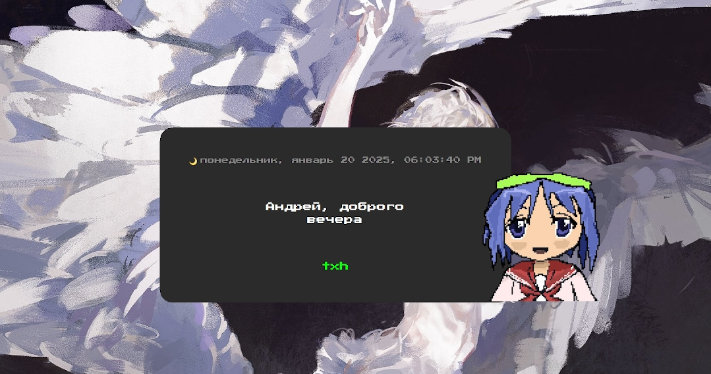

---

# Morning Reminder for Self-Care

This project is a morning reminder designed to help people with ADHD (Attention Deficit Hyperactivity Disorder) not forget about their needs and start the day with positivity. Every day, the program generates personalized wishes based on the current date, time of day, and the user's name using the Groq neural network API. Music - cover of "Undertale - Waterfall," (piano) and a drawing created by my friend Dräug.


## Features

- 🌅 Dynamic morning messages based on time of day
- 🎨 Customizable character with open/closed mouth animation
- 🌍 Multi-language support (English and Russian)
- 🎵 Background music and sound effects
- ⚙️ Customizable settings:
  - Language selection
  - Model selection
  - Custom prompts
  - Character images
- 🖼️ Custom character images support
- 🎯 Modern, frameless UI with rounded corners




## How to Run

### 1. Get an API Token

To interact with the Groq neural network API, you need to get an API token. Follow these steps:

1. Go to [https://groq.com](https://groq.com).
2. Register and obtain your API token.

### 2. Setup

Once you have your API token:

1. Save it in a convenient location, such as a text file.
2. When running the program, input your token and your name.

### 3. Add to Startup (Optional)

To have the program run automatically on system startup:

1. Navigate to the **Shell:Startup** folder.
   - On Windows: `C:\Users\Your_Name\AppData\Roaming\Microsoft\Windows\Start Menu\Programs\Startup`
   
2. Add a shortcut of the program to this folder so that it runs automatically when your system starts.

---

### Note:

If you encounter any issues or have questions during setup, feel free to reach out for help.

---

## Building with Cython

This project now uses Cython for improved performance. To build the Cython modules:

1. Install the requirements:
```bash
pip install -r requirements.txt
```

2. Build the Cython modules:
```bash
python setup.py build_ext --inplace
```

3. Run the application as usual:
```bash
python main.py
```

### Build Steps

1. Clone the repository:
```bash
git clone <repository-url>
cd Good-morning
```

2. Create and activate a virtual environment (recommended):
```bash
# Windows
python -m venv venv
venv\Scripts\activate

# Linux/macOS
python -m venv venv
source venv/bin/activate
```

3. Install the requirements:
```bash
pip install -r requirements.txt
```

4. Build the Cython modules:
```bash
python setup.py build_ext --inplace
```

5. Run the application:
```bash
python main.py
```


Note: You need a C/C++ compiler installed on your system to build the Cython modules:
- Windows: Microsoft Visual C++ Build Tools
- Linux: GCC
- macOS: Xcode Command Line Tools

